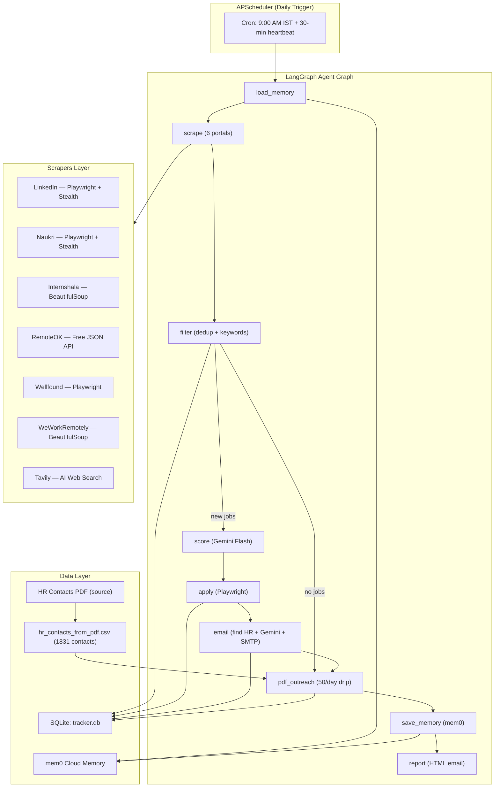

# Deb Job Agent — Complete Technical Documentation

> **Author:** Debashis Bera | Final Year B.Tech CSE
> **Purpose:** Autonomous AI-powered daily job application agent — scrapes job portals, scores and filters with Gemini AI, auto-applies, sends personalized cold emails (job-based + PDF HR drip), monitors inbox, and emails a daily HTML summary report.

---

## Table of Contents

1. [Project Overview](#1-project-overview)
2. [High-Level Architecture](#2-high-level-architecture)
3. [Complete Project Structure](#3-complete-project-structure)
4. [Full Tech Stack](#4-full-tech-stack)
5. [LangGraph Agent Workflow](#5-langgraph-agent-workflow)
6. [Node-by-Node Breakdown](#6-node-by-node-breakdown)
7. [Scrapers — How Each Portal Is Scraped](#7-scrapers)
8. [AI / LLM Integration (Gemini)](#8-ai--llm-integration-gemini)
9. [Email System — Three Channels](#9-email-system)
10. [Database Schema (SQLite)](#10-database-schema-sqlite)
11. [Memory System (mem0)](#11-memory-system-mem0)
12. [PDF HR Contact Drip Campaign](#12-pdf-hr-contact-drip-campaign)
13. [Inbox Monitor and Reply Classifier](#13-inbox-monitor--reply-classifier)
14. [Daily Report System](#14-daily-report-system)
15. [Scheduler and Deployment](#15-scheduler--deployment)
16. [Configuration System](#16-configuration-system)
17. [State Management (LangGraph TypedDict)](#17-state-management)
18. [Rate Limiting and Anti-Ban Strategies](#18-rate-limiting--anti-ban-strategies)
19. [Web Dashboard (Flask)](#19-web-dashboard-flask)
20. [Setup and Run Guide](#20-setup--run-guide)
21. [Common Interview Questions and Answers](#21-common-interview-questions--answers)
22. [Key Design Decisions](#22-key-design-decisions)

---

## 1. Project Overview

| Property | Detail |
|----------|--------|
| **Goal** | Fully automated daily job application pipeline for a fresher CSE student |
| **Runs** | Daily at configurable time (9:00 AM IST) via APScheduler |
| **Portals scraped** | LinkedIn, Naukri, Internshala, RemoteOK, Wellfound, WeWorkRemotely, Tavily AI search |
| **AI model** | Google Gemini Flash (gemini-1.5-flash) via google-genai SDK |
| **Orchestration** | LangGraph — stateful directed graph with conditional edges |
| **Email channels** | 1) Job cold email, 2) PDF HR drip (50/day from 1831 contacts), 3) Daily summary |
| **Storage** | SQLite (tracker.db) — applications, HR contacts, PDF outreach, daily stats |
| **Memory** | mem0 cloud memory (optional) + SQLite for cross-session context |
| **Dashboard** | Flask web app for real-time monitoring |

---

## 2. High-Level Architecture



### Complete System Data Flow

```
.env / user_profile.json
        |
        v
    config.py  (loads all settings)
        |
        v
    main.py  (APScheduler + Flask)
        |
        v
    agent/graph.py  (builds LangGraph StateGraph)
        |
        v
    ┌─────────────────────────────────────────────┐
    │         LangGraph Execution                  │
    │                                              │
    │  load_memory                                 │
    │      ↓                                       │
    │  scrape ──► LinkedIn, Naukri, Internshala,   │
    │             RemoteOK, Wellfound, Tavily       │
    │      ↓                                       │
    │  filter ──► SHA256 dedup (SQLite)            │
    │             Keyword blacklist/whitelist        │
    │      ↓                                       │
    │  score ──► Gemini: batch score 0-10          │
    │      ↓                                       │
    │  apply ──► Playwright per portal             │
    │      ↓                                       │
    │  email ──► Apollo/Snov/Tavily/Pattern        │
    │            Gemini: generate email batch       │
    │            Gmail SMTP: send + attach resume   │
    │      ↓                                       │
    │  pdf_outreach ──► CSV batch 50               │
    │                   MX validate                 │
    │                   Gemini: personalize         │
    │                   Gmail SMTP: send            │
    │      ↓                                       │
    │  save_memory ──► mem0 cloud                  │
    │      ↓                                       │
    │  report ──► IMAP: read inbox                 │
    │             classify bounces                  │
    │             Gmail SMTP: send HTML report      │
    └─────────────────────────────────────────────┘
```

---

## 3. Complete Project Structure

```
Job Agent/
├── .env                             # All secrets (API keys, credentials)
├── .env.template                    # Copy this for new setup
├── config.py                        # Central config loader
├── main.py                          # Entry point: Flask + APScheduler + CLI
├── requirements.txt                 # All Python package dependencies
│
├── agent/
│   ├── __init__.py
│   ├── graph.py                     # StateGraph: nodes, edges, conditional edges
│   ├── state.py                     # AgentState TypedDict definition
│   └── nodes/
│       ├── scrape_node.py           # Orchestrates all scrapers
│       ├── filter_node.py           # Dedup + keyword filter + Gemini scoring
│       ├── apply_node.py            # Auto-apply via Playwright (per portal)
│       ├── email_node.py            # HR email finder + generator + sender
│       ├── memory_node.py           # Load/save mem0 cloud memory
│       ├── pdf_outreach_node.py     # Daily 50-email PDF HR drip
│       └── report_node.py           # HTML report generator + emailer
│
├── scrapers/
│   ├── linkedin_scraper.py          # Playwright + stealth + iterative selectors
│   ├── naukri_scraper.py            # Playwright + stealth
│   ├── internshala_scraper.py       # BeautifulSoup HTML parsing
│   ├── remoteok_scraper.py          # Free public JSON API
│   ├── wellfound_scraper.py         # Playwright (no login)
│   └── weworkremotely_scraper.py    # BeautifulSoup RSS/HTML
│
├── tools/
│   ├── email_finder.py              # Apollo, Snov, Tavily, pattern-based discovery
│   ├── email_sender.py              # Gmail SMTP (cold + HTML report)
│   ├── inbox_monitor.py             # IMAP reader + bounce classifier
│   ├── pdf_hr_parser.py             # pdfplumber parser + drip batch logic
│   └── tavily_search.py             # Tavily AI web search wrapper
│
├── database/
│   ├── db_manager.py                # All SQLite CRUD operations
│   └── tracker.db                   # SQLite database (auto-created)
│
├── data/
│   ├── user_profile.json            # Your resume data (name, skills, projects)
│   ├── CompanyWise HR contact.pdf   # 1831 HR contacts (source PDF)
│   ├── hr_contacts_from_pdf.csv     # Parsed contacts (auto-generated once)
│   ├── mem0_cache.json              # 24h retrieval cache (auto-generated)
│   └── mem0_sync.json               # Save guard (auto-generated)
│
├── dashboard/
│   └── app.py                       # Flask dashboard routes + API
│
├── templates/                       # HTML email templates
├── logs/                            # agent_YYYY-MM-DD.log (daily rotation)
└── venv/                            # Python virtual environment
```

---

## 4. Full Tech Stack

### Core AI and Orchestration

| Technology | Version | Role |
|-----------|---------|------|
| **LangGraph** | >=0.2.0 | Stateful directed graph for agentic workflow |
| **LangChain** | >=0.3.0 | Ecosystem utilities, prompt templates |
| **Google Gemini Flash** | gemini-1.5-flash | Job scoring, email generation |
| **google-genai SDK** | latest | Direct Gemini API client |
| **mem0** | >=0.1.0 | Cloud memory for cross-session context |
| **tenacity** | >=8.2.0 | Retry decorator for Gemini calls |

### Web Scraping and Browser Automation

| Technology | Version | Role |
|-----------|---------|------|
| **Playwright** | >=1.45.0 | Headless browser (LinkedIn, Naukri, Wellfound) |
| **playwright-stealth** | >=1.0.6 | Bot detection bypass |
| **BeautifulSoup4** | >=4.12.0 | HTML parsing (Internshala, WeWorkRemotely) |
| **requests** | >=2.31.0 | HTTP client (RemoteOK API) |
| **lxml** | >=5.0.0 | Fast XML/HTML parser for BeautifulSoup |
| **Tavily Python** | >=0.5.0 | AI-powered web search API |

### Email System

| Technology | Role |
|-----------|------|
| **smtplib** (stdlib) | Gmail SMTP SSL port 465 — sends cold emails |
| **imaplib** (stdlib) | Gmail IMAP — reads inbox for recruiter replies |
| **email.mime** (stdlib) | MIME message builder (text, HTML, PDF attachment) |
| **dnspython** | MX record validation before sending |
| **email-validator** | Email address format validation |

### Data and Storage

| Technology | Role |
|-----------|------|
| **SQLite** (stdlib) | Main database — zero-server setup |
| **pdfplumber** | Extract text/tables from HR contact PDF |
| **PyPDF2** | PDF utilities |
| **pandas** | CSV data manipulation |

### Infrastructure and Scheduling

| Technology | Role |
|-----------|------|
| **APScheduler** | Cron-based daily trigger |
| **Flask** | Web dashboard |
| **flask-cors** | CORS for dashboard API |
| **python-dotenv** | Load .env into environment |
| **colorlog** | Colorized terminal logging |
| **pytz** | Timezone-aware scheduling (Asia/Kolkata) |

### Python Standard Library (Key Modules Used)

```
asyncio     — Async Playwright browser operations
threading   — Flask runs in a daemon background thread
logging     — Structured logging (file + console handlers)
hashlib     — SHA-256 URL hashing for deduplication
socket      — DNS resolution for email domain validation
re          — Regex for email extraction from PDF text
json        — Parsing Gemini API JSON responses
pathlib     — Cross-platform file paths
datetime    — Date formatting and comparison
smtplib     — SMTP email sending
imaplib     — IMAP email reading
sqlite3     — Database operations
csv         — CSV HR contact list reading
```

---

## 5. LangGraph Agent Workflow

### Graph Wiring (agent/graph.py)

```python
graph = StateGraph(AgentState)

# Nodes
graph.add_node("load_memory", load_memory_node)
graph.add_node("scrape",      scrape_jobs_node)
graph.add_node("filter",      filter_deduplicate_node)
graph.add_node("score",       score_and_rank_node)
graph.add_node("apply",       auto_apply_node)
graph.add_node("email",       email_node)
graph.add_node("pdf_outreach",pdf_outreach_node)
graph.add_node("save_memory", save_memory_node)
graph.add_node("report",      generate_report_node)

# Edges
graph.add_edge(START, "load_memory")
graph.add_edge("load_memory", "scrape")
graph.add_edge("scrape", "filter")

# Conditional: if no new jobs, skip scoring/applying but still run PDF drip
graph.add_conditional_edges("filter", should_continue_after_filter,
    {"score": "score", "pdf_outreach": "pdf_outreach"})

graph.add_edge("score", "apply")
graph.add_edge("apply", "email")
graph.add_edge("email", "pdf_outreach")
graph.add_edge("pdf_outreach", "save_memory")
graph.add_edge("save_memory", "report")
graph.add_edge("report", END)
```

### Conditional Edge Logic

```python
def should_continue_after_filter(state: AgentState) -> str:
    if not state.get("new_jobs"):
        # No new jobs today — skip scoring/applying
        # BUT still run PDF HR drip (50 cold emails)
        return "pdf_outreach"
    return "score"
```

**Why this design?** Even if no new jobs are found, the PDF HR drip (50 cold emails to recruiter contacts from the PDF list) must still run every day. The conditional edge ensures it is never skipped.

### State Data Flow Through Graph

```
START
  load_memory   => memory_context (str)
  scrape        => raw_jobs (List[Dict]), total_scraped (int)
  filter        => new_jobs (List[Dict]), total_new (int)
  score         => scored_jobs (List[Dict]), jobs_to_apply (List[Dict])
  apply         => application_results (List[ApplicationResult])
                   total_applied (int), total_failed (int)
  email         => emails_sent (List[Dict]), total_emailed (int)
  pdf_outreach  => pdf_emails_sent (int)
  save_memory   => {} (side-effect only: saves to mem0)
  report        => report_html (str)
END
```

---

## 6. Node-by-Node Breakdown

### load_memory — Memory Load Node

**File:** agent/nodes/memory_node.py

Steps:
1. Query SQLite for all-time stats (total applied, emailed, unique companies)
2. If USE_MEM0=True, check local cache file `data/mem0_cache.json`
   - If cache has today's date: use cached context (no API call)
   - If not: call mem0 API with query "job applications today progress stats", save to cache
3. Populate `state["memory_context"]` string

**Cache file format:**
```json
{
  "last_retrieval_date": "2026-06-15",
  "context": "All-time applications: 45\nAll-time emails: 120..."
}
```

---

### scrape — Scrape Node

**File:** agent/nodes/scrape_node.py

Sequentially runs all enabled scrapers, merges results into `raw_jobs`.

| Priority | Scraper | Method | Login? |
|----------|---------|--------|--------|
| 1 | RemoteOK | Free JSON API | No |
| 2 | Internshala | BeautifulSoup | Optional |
| 3 | Wellfound | Playwright | No |
| 4 | WeWorkRemotely | BeautifulSoup | No |
| 5 | LinkedIn | Playwright + Stealth | Yes (optional) |
| 6 | Naukri | Playwright + Stealth | Yes (optional) |
| 7 | Tavily | AI web search | API key |

Each scraper failure is caught and logged — the pipeline continues with results from working scrapers.

---

### filter — Deduplication and Relevance Filter

**File:** agent/nodes/filter_node.py

**Stage 1 — Deduplication (SQLite):**
```python
job_hash = hashlib.sha256(job_url.encode()).hexdigest()[:16]
# Skip if already in DB with status "applied" or "email_sent"
# (jobs with "new" or "manual_required" can be retried)
```

**Stage 2 — Keyword blacklist (title check):**
Immediately rejects: video editor, java developer, spring boot, .net developer,
php developer, laravel, wordpress, ruby on rails, salesforce, android developer,
graphic designer, mechanical, electrical, civil, sales, bpo, accountant...

**Stage 3 — Java-heavy JD rule:**
```python
# If JD mentions "java" 3+ times AND has no Python/AI keywords -> reject
java_desc_heavy = (
    description.count("java") >= 3 and
    not any(kw in description for kw in ["python", "ai", "ml", ...])
)
```

**Stage 4 — Whitelist tech check (must match at least one):**
software, python, ai, ml, machine learning, backend, fullstack, C++,
generative, LLM, NLP, deep learning, computer vision, developer, engineer

**Stage 5 — Senior role exclusion:**
Rejects if contains: "5+ years", "7+ years", "senior", "lead engineer",
"principal", "director", "vp of", "head of engineering", "cto"

---

### score — LLM-Based Job Scoring

**File:** agent/nodes/filter_node.py (score_and_rank_node)

**Single Gemini call** for ALL jobs:
```python
compact_jobs = [{"id": i, "title": job["title"][:80],
                 "company": job["company"][:50],
                 "desc": job["description"][:150],
                 "portal": job["portal"]} for i, job in enumerate(jobs)]

prompt = f"""Score each job 0-10 for a fresher CSE student skilled in Python/AI/ML.
10=Perfect (Python/AI, explicitly fresher/entry level)
7-9=Good (relevant, probably accepts freshers)
4-6=Okay (software role, less relevant)
0-3=Bad (senior, irrelevant, heavy experience)
Return ONLY JSON: [{{"id": 0, "score": 8.5}}, ...]"""
```

Jobs sorted by score descending. Top `MAX_APPLY_PER_DAY` selected for today.
Scores also written to SQLite for dashboard display.

---

### apply — Auto-Apply Node

**File:** agent/nodes/apply_node.py

| Portal | Behavior |
|--------|---------|
| linkedin | manual_required -> routed to cold email |
| naukri | manual_required -> cold email |
| internshala | manual_required -> cold email |
| remoteok | email_sent -> cold email only (paid apply portal) |
| weworkremotely | email_sent -> cold email only (paid portal) |
| wellfound | manual_required -> cold email |

Human-like delay: `random.uniform(10, 30)` seconds between applications in live mode.
Each result written to SQLite with status and notes.

---

### email — Job Cold Email Node

**File:** agent/nodes/email_node.py

**Step 1: HR Email Discovery** (for each company, using waterfall):
1. Apollo.io API (verified business emails, most accurate)
2. Snov.io API (email finder by domain)
3. Tavily AI search: `"site:company.com HR careers email"`
4. Pattern generation: hr@, careers@, hiring@, talent@, jobs@, recruit@ + domain
5. MX record validation (dnspython) — reject if domain has no MX records

**Step 2: Gemini Email Generation** (batches of 5 per call):
- Input: user profile, skills, best project, portfolio/GitHub, job description snippet
- Output: JSON array [{id, subject, body}]
- Strict style rules: starts with "Hey [HR Name]," never "Dear/Respected/Hi"
- No cliches: no "I hope this email finds you well", "thrilled to apply", etc.
- Fallback to template if Gemini fails

**Step 3: SMTP Send:**
- Gmail SMTP SSL port 465
- Attaches resume PDF (MIMEBase, base64 encoded)
- 30-second delay between sends
- Each sent email marked in SQLite

---

### pdf_outreach — PDF HR Drip Node

**File:** agent/nodes/pdf_outreach_node.py

See full details in Section 12.

---

### save_memory — Memory Save Node

**File:** agent/nodes/memory_node.py

Saves today's summary to mem0 cloud:
```
"On 2026-06-15: Scraped 25 jobs, applied to 5, sent 12 cold emails.
Companies: TechCorp, StartupXYZ, InnovateCo..."
```

Protected by `data/mem0_sync.json` — skips if same summary already saved today.

---

### report — Daily Report Node

**File:** agent/nodes/report_node.py

See full details in Section 14.

---

## 7. Scrapers

### LinkedIn (scrapers/linkedin_scraper.py)

**Technology:** playwright + playwright-stealth (async)

**Login flow — iterative selector strategy (robust against DOM changes):**
```python
# For EACH selector separately (not all at once):
for sel in ["#username", "input[name='session_key']",
            "input[autocomplete='username']", "input[type='email']"]:
    try:
        el = page.locator(sel).first
        if await el.count() > 0:
            await el.wait_for(state="visible", timeout=5000)
            await el.fill(email)
            filled_username = True
            break
    except Exception:
        continue
```

**Why iterative selectors?** LinkedIn's DOM changes frequently. A comma-separated selector resolves to the first matching element which may not be visible/interactable. Trying each separately with a short 5s timeout is more reliable.

**Stealth patches (playwright-stealth):**
- navigator.webdriver = undefined
- Chrome plugins array realistic
- Canvas fingerprint randomized
- WebGL vendor/renderer spoofed
- Audio context fingerprint patched
- Languages/platform realistic

**Login success detection:**
```python
if any(part in page.url for part in ["/feed", "/mynetwork", "/jobs"]):
    # Login successful
elif "checkpoint" in page.url:
    # CAPTCHA detected — continue with public search
elif "login" in page.url:
    # Wrong credentials or bot-blocked — continue with public search
```

**Job extraction:** `div.job-search-card` or `li.jobs-search-results__list-item`
**Search configs:** 6 queries (python developer, ML engineer, GenAI, remote US, etc.)

---

### Naukri (scrapers/naukri_scraper.py)

playwright + stealth. Login to Naukri, navigate to fresher-specific search URLs, extract job cards from React DOM.

---

### Internshala (scrapers/internshala_scraper.py)

requests + BeautifulSoup4. Scrapes static HTML listing pages (no JS rendering needed). Targets internship/fresher job listings.

---

### RemoteOK (scrapers/remoteok_scraper.py)

Free public JSON API: `https://remoteok.com/api`
- Returns structured JSON — no browser or login needed
- Filtered for python, ai, ml, machine-learning tags

---

### Wellfound (scrapers/wellfound_scraper.py)

Playwright without login. Waits for React hydration, extracts startup job cards.

---

### WeWorkRemotely (scrapers/weworkremotely_scraper.py)

requests + BeautifulSoup4. Scrapes RSS feed and HTML job listings for programming/software category.

---

### Tavily AI Search (tools/tavily_search.py)

```python
results = client.search(
    query="python AI ML engineer fresher remote jobs 2024",
    search_depth="advanced",
    max_results=5
)
```
Budget: max 30 searches/day (free tier ~1000/month).
Scrape phase uses max 10; 5 reserved for HR email discovery.

---

## 8. AI / LLM Integration (Gemini)

### Model Configuration

```
Model:    gemini-1.5-flash
Provider: Google AI Studio
SDK:      google-genai (direct client)
```

### Where Gemini Is Used Per Run

| Node | Purpose | API Calls |
|------|---------|-----------|
| score (filter_node) | Score all jobs 0-10 in one batch | 1 |
| email (email_node) | Generate cold emails (5 per call) | ~2-5 |
| pdf_outreach | Generate 50 HR emails (5 per call) | ~10 |
| **Total per run** | | **~13-16 calls** |

### Rate Limit Strategy (Free Tier)

```python
GEMINI_MAX_RPM = 12           # Conservative — free limit is 15 RPM
GEMINI_DELAY_BETWEEN_CALLS = 5  # Seconds between LLM calls
GEMINI_BATCH_SIZE = 10        # Score 10 jobs per call
EMAIL_BATCH_SIZE = 5          # Generate 5 emails per call
```

### Retry Logic (pdf_outreach_node — no google.api_core dependency)

```python
def _call_gemini_with_retry(prompt_text: str) -> str:
    last_exc = None
    for attempt in range(4):
        try:
            resp = client.models.generate_content(
                model=cfg.GEMINI_MODEL,
                contents=prompt_text,
            )
            return resp.text
        except Exception as exc:
            last_exc = exc
            wait_secs = 5 * (2 ** attempt)  # 5, 10, 20, 40 seconds
            logger.warning(f"Gemini attempt {attempt+1}/4 failed. Retrying in {wait_secs}s...")
            time.sleep(wait_secs)
    raise last_exc
```

### Prompt Design Principles

1. **Batched inputs** — All items sent in one prompt as JSON array (minimize API calls)
2. **Locked output format** — Every prompt ends with: `"Return ONLY valid JSON. No markdown, no explanation."`
3. **JSON cleanup** — Strip markdown code fences before `json.loads()`:
   ```python
   if "```" in text:
       text = text.split("```")[1]
       if text.startswith("json"):
           text = text[4:]
   ```
4. **Fallback templates** — Every LLM call has a hardcoded fallback so the agent never crashes on Gemini failure

---

## 9. Email System

### Channel 1: Job-Based Cold Emails

- **Who:** HR/hiring managers at companies with open roles found today
- **Discovery:** Apollo -> Snov -> Tavily -> Pattern -> MX validation
- **Content:** AI-generated, job-specific, resume PDF attached
- **Volume:** Up to MAX_EMAIL_PER_DAY (default: 25/day)
- **Delay:** 30 seconds between sends

### Channel 2: PDF HR Drip Campaign

- **Who:** 1831 HR contacts from a PDF contact list (sequential, never repeat)
- **Rate:** Exactly 50 emails per day
- **Timeline:** 1831 / 50 = ~37 days to cover all contacts
- **Content:** AI-generated, personalized to name/company/designation
- **MX validation:** Checked before every send

### Channel 3: Daily Summary Report

- **Who:** Your personal email (PERSONAL_EMAIL in .env)
- **When:** End of every agent run
- **Format:** HTML email with stats + bounce count + recruiter replies

### SMTP Implementation (tools/email_sender.py)

```python
# Build MIME message
msg = MIMEMultipart()
msg["From"] = gmail_address
msg["To"] = to_email
msg["Subject"] = subject
msg.attach(MIMEText(body, "plain"))

# Attach resume PDF
with open(resume_path, "rb") as f:
    part = MIMEBase("application", "octet-stream")
    part.set_payload(f.read())
    encoders.encode_base64(part)
    part.add_header("Content-Disposition",
                    f"attachment; filename={resume_path.name}")
    msg.attach(part)

# Send via Gmail SMTP SSL
with smtplib.SMTP_SSL("smtp.gmail.com", 465) as server:
    server.login(gmail_address, app_password)
    server.sendmail(gmail_address, [to_email], msg.as_string())
```

### App Password vs OAuth

App Passwords (16-character Google-generated password) are used instead of OAuth because:
- OAuth requires a web redirect flow and token refresh management
- App Passwords are stable and work perfectly for server-side automation
- Simpler to configure for a personal project

**Setup:** Google Account -> Security -> 2-Step Verification -> App passwords

---

## 10. Database Schema (SQLite)

**File:** database/tracker.db
**Manager:** database/db_manager.py

One-time init guard:
```python
_DB_INITIALIZED: set = set()  # Module-level set

def _init_db(self):
    if self.db_path not in _DB_INITIALIZED:
        _DB_INITIALIZED.add(self.db_path)
        # Create tables — only runs ONCE per process
        logger.info(f"Database initialized at {self.db_path}")
```
This prevents the "Database initialized" message from spamming every minute.

### Table: applications

```sql
CREATE TABLE applications (
    id               INTEGER PRIMARY KEY AUTOINCREMENT,
    job_hash         TEXT UNIQUE NOT NULL,  -- SHA-256[:16] of job URL
    job_url          TEXT,
    job_title        TEXT,
    company          TEXT,
    location         TEXT,
    portal           TEXT,         -- "linkedin","naukri","remoteok", etc.
    job_description  TEXT,
    status           TEXT DEFAULT 'new',  -- new|applied|email_sent|failed|manual_required
    applied_date     TEXT,
    hr_email         TEXT,
    email_sent       INTEGER DEFAULT 0,   -- 0 or 1 (boolean)
    email_sent_date  TEXT,
    relevance_score  REAL DEFAULT 0,      -- 0.0-10.0 from Gemini
    notes            TEXT,
    created_at       TEXT DEFAULT CURRENT_TIMESTAMP
);
```

### Table: pdf_hr_outreach

```sql
CREATE TABLE pdf_hr_outreach (
    id          INTEGER PRIMARY KEY AUTOINCREMENT,
    email       TEXT UNIQUE NOT NULL,
    name        TEXT,
    company     TEXT,
    designation TEXT,
    sent_date   TEXT,
    status      TEXT DEFAULT 'pending'
    -- pending | sent | invalid | failed | dry_run
);
```

Key constraint: batch query uses `WHERE status NOT IN ('sent', 'invalid', 'failed', 'dry_run')` — only pending contacts are fetched.

### Table: daily_stats

```sql
CREATE TABLE daily_stats (
    date              TEXT PRIMARY KEY,   -- YYYY-MM-DD
    total_scraped     INTEGER DEFAULT 0,
    total_new         INTEGER DEFAULT 0,
    total_applied     INTEGER DEFAULT 0,
    total_emailed     INTEGER DEFAULT 0,
    total_failed      INTEGER DEFAULT 0,
    run_time_seconds  REAL DEFAULT 0
);
```

### Table: hr_contacts

```sql
CREATE TABLE hr_contacts (
    id             INTEGER PRIMARY KEY AUTOINCREMENT,
    company        TEXT,
    company_domain TEXT,
    hr_name        TEXT,
    hr_email       TEXT,
    source         TEXT,   -- "apollo","snov","tavily","pattern"
    verified       INTEGER DEFAULT 0,
    created_at     TEXT DEFAULT CURRENT_TIMESTAMP,
    UNIQUE(company_domain, hr_email)
);
```

### Table: tavily_usage

```sql
CREATE TABLE tavily_usage (
    date  TEXT PRIMARY KEY,   -- YYYY-MM-DD
    count INTEGER DEFAULT 0
);
-- Guards Tavily free tier: max 30 searches/day
```

### Deduplication Flow

```python
def make_job_hash(job_url: str) -> str:
    return hashlib.sha256(job_url.encode()).hexdigest()[:16]

def is_already_seen(self, job_url: str) -> bool:
    row = conn.execute(
        "SELECT status FROM applications WHERE job_hash = ?",
        (make_job_hash(job_url),)
    ).fetchone()
    if not row:
        return False
    # Only skip if truly processed (applied or email_sent)
    # "new" or "manual_required" can be retried
    return row["status"] in ("applied", "email_sent")
```

---

## 11. Memory System (mem0)

### What Is mem0?

mem0 is a managed cloud memory service that stores and retrieves text "memories" per user ID using semantic search. It lets the agent remember across daily runs without re-reading the entire SQLite DB.

**Website:** mem0.ai
**SDK:** `pip install mem0ai`

### How It Is Used

```python
# On START (load_memory):
client.search(
    query="job applications today progress stats",
    filters={"user_id": "job_agent_user_001"},
    limit=5
)
# Returns: List of matching memories as strings

# On END (save_memory):
client.add(
    "On 2026-06-15: Scraped 25 jobs, applied to 5, sent 12 cold emails. Companies: TechCorp...",
    user_id="job_agent_user_001",
    metadata={"date": "2026-06-15", "type": "daily_summary"}
)
```

### Quota Protection Architecture

```
mem0_cache.json            mem0_sync.json
{                          {
  "last_retrieval_date":     "last_sync_date": "2026-06-15",
  "2026-06-15",              "summary": "On 2026-06-15: ..."
  "context": "..."         }
}

load_memory logic:           save_memory logic:
- If cache date = today      - If sync date = today AND
  -> use cache (no API call)   summary unchanged
- Else -> call mem0 API        -> skip (no duplicate save)
  -> update cache            - Else -> call client.add()
                               -> update sync file
```

### Optional Dependency

`USE_MEM0 = bool(MEM0_API_KEY)` — if no API key is configured, mem0 is completely skipped. The agent works perfectly without it, using SQLite stats only.

---

## 12. PDF HR Contact Drip Campaign

### Overview

1831 HR contacts extracted from a PDF file -> 50 personalized cold emails per day -> covers all contacts in approximately 37 days, running automatically.

### Step 1: PDF Parsing (tools/pdf_hr_parser.py)

Run once. `pdfplumber` extracts tables from each page:

```python
with pdfplumber.open(pdf_path) as pdf:
    for page in pdf.pages:
        # Primary: table extraction
        tables = page.extract_tables()
        for table in tables:
            for row in table:
                # Cells: [Name, Company, Designation, Email]

        # Fallback: text extraction + regex
        text = page.extract_text()
        emails = re.findall(r'\b[A-Za-z0-9._%+-]+@[A-Za-z0-9.-]+\.[A-Z|a-z]{2,}\b', text)
        # Context: look at +-2 surrounding lines for name/company/designation
```

**Output:** `data/hr_contacts_from_pdf.csv` with columns: name, company, designation, email

### Step 2: Batch Selection Logic

```python
def get_next_pdf_hr_batch(count=50):
    # 1. Get all already-processed emails from DB
    rows = conn.execute("""
        SELECT email FROM pdf_hr_outreach
        WHERE status IN ('sent', 'invalid', 'failed', 'dry_run')
    """)
    processed_emails = {r["email"].lower() for r in rows}

    # 2. Read CSV sequentially, skip processed contacts
    contacts = []
    for row in csv_reader:
        email = row["email"].strip().lower()
        if email and email not in processed_emails:
            contacts.append(row)
            if len(contacts) >= count:
                break

    return contacts  # Next batch (e.g., contacts 101-150 on day 3)
```

**Critical bug that was fixed:** The original query only excluded `status = 'sent'`. Contacts marked `invalid` or `failed` were re-fetched and wasted the 50-slot buffer, causing the drip to silently stall at the same batch.

### Step 3: Same-Day Quota Protection

```python
stats = get_pdf_hr_stats()
# stats["sent_today"] = COUNT(*) WHERE sent_date = today AND status = "sent"
already_sent_today = stats["sent_today"]
remaining_quota = max(0, 50 - already_sent_today)

if remaining_quota == 0:
    # Already sent 50 today (e.g., agent re-run) — skip entirely
    return {"pdf_emails_sent": 0}
```

### Step 4: MX Validation Before Send

```python
def _validate_email_mx(email: str) -> bool:
    domain = email.split("@")[-1]
    try:
        socket.gethostbyname(domain)           # DNS A record
        dns.resolver.resolve(domain, "MX")    # MX record
        return True
    except Exception:
        return False
# Invalid -> mark "invalid" in DB -> never retried
```

### Step 5: AI Personalization

Gemini generates emails using contact's name, designation, and company:

```
Input: {"name": "Priya Sharma", "designation": "Head of Talent Acquisition",
        "company": "Infosys", "email": "priya.sharma@infosys.com"}

Output:
Subject: Fresh CSE Graduate | Python & AI/ML | Seeking Opportunity at Infosys
Body:
Hey Priya,

As Head of Talent Acquisition at Infosys, you'd know best...
[personalized 4-6 paragraph email]

Best regards,
Debashis Bera
```

Fallback template available if Gemini call fails.

---

## 13. Inbox Monitor and Reply Classifier

**File:** tools/inbox_monitor.py

### IMAP Reading

```python
mail = imaplib.IMAP4_SSL("imap.gmail.com", 993)
mail.login(GMAIL_ADDRESS, GMAIL_APP_PASSWORD)
mail.select("inbox")

since_date = (datetime.now() - timedelta(days=3)).strftime("%d-%b-%Y")
_, msg_nums = mail.search(None, f'SINCE {since_date}')

# Read last 30 messages (most recent first)
for num in reversed(msg_nums[0].split()[-30:]):
    _, msg_data = mail.fetch(num, "(RFC822)")
    # Parse: sender, subject, date, body snippet (150 chars)
```

### Three-Class Classification (report_node.py)

**Class 1 — Bounce-back (counted, NOT listed):**
```python
BOUNCE_PATTERNS = [
    r"mailer-daemon", r"mail delivery", r"delivery failure",
    r"undeliverable", r"address not found", r"does not exist",
    r"no such user", r"550", r"554", r"postmaster",
    r"auto-reply", r"out of office", r"vacation",
]
BOUNCE_SENDER_DOMAINS = {"mailer-daemon", "postmaster", "bounces", "no-reply", ...}
```

**Class 2 — Portal/marketing mail (silently dropped):**
```python
PORTAL_DOMAINS = {"linkedin.com", "naukri.com", "internshala.com", "indeed.com",
                  "google.com", "github.com", "youtube.com", ...}
```

**Class 3 — Real recruiter replies (shown in detail):**
- Not a bounce-back
- Not from a portal/marketing domain

### Report Output Example

```
Today's Summary — 2026-06-15

Applied today:        5
Total applied (all):  45
Cold emails (jobs):   12
PDF cold mails:       50  (Total: 150/1831 from PDF list)
Failures today:       2

3 emails bounced back (address does not exist / invalid domain).

Recruiter Replies (1):
  From: priya.sharma@infosys.com
  Subject: Re: Final Year CSE | Python & AI/ML
  Snippet: "Thank you for reaching out! We'd love to schedule..."

[OR if no replies:]
No replies yet from any HR / recruiter you contacted.
Keep going — replies take time!
```

---

## 14. Daily Report System

**File:** agent/nodes/report_node.py

### Report Generation Steps

1. Fetch inbox via IMAP (last 3 days, 30 emails max)
2. Classify: bounce vs portal vs recruiter reply
3. Read all stats from AgentState
4. Query SQLite for all-time totals
5. Query PDF drip stats (total sent, sent today, remaining)
6. Build HTML email body
7. Log clean summary to console/log file
8. Send HTML email to PERSONAL_EMAIL via Gmail SMTP

### Email Subject Format

```
[Job Agent] 2026-06-15 | Applied: 5 | Emails: 12 | PDF: 150/1831 | Replies: 1
```

### Key Design: Always Sends Regardless of dry_run

```python
sent_ok = sender.send_summary_email(
    to_email=cfg.PERSONAL_EMAIL,
    subject=subject,
    html_body=html,
    dry_run=False,  # Always send — you always want to know what happened
)
```

### HTML Email Structure

```html
Section 1: Quick numeric summary (applied today, total, cold mails, PDF progress)
Section 2: Bounce-back count (red alert box — count only, no listing)
Section 3: Recruiter replies (yellow box) OR "no replies yet" message
Section 4: Application list for today (ordered list with status colors)
Footer: Date, Gmail address
```

---

## 15. Scheduler and Deployment

### APScheduler Configuration (main.py)

```python
from apscheduler.schedulers.blocking import BlockingScheduler
from apscheduler.triggers.cron import CronTrigger
import pytz

tz = pytz.timezone("Asia/Kolkata")
scheduler = BlockingScheduler(timezone=tz)

# Daily agent run at 9:00 AM IST
scheduler.add_job(
    func=run_agent,
    trigger=CronTrigger(hour=cfg.SCHEDULE_HOUR, minute=cfg.SCHEDULE_MINUTE, timezone=tz),
    id="daily_job_agent",
    misfire_grace_time=3600,  # Run up to 1 hour late if system was sleeping
    coalesce=True,            # Only run once even if multiple misfires
)

# 30-minute heartbeat
scheduler.add_job(
    func=_heartbeat,
    trigger="interval",
    minutes=30,
    id="heartbeat",
)

scheduler.start()  # Blocks main thread
```

### Heartbeat Log (Every 30 Minutes)

```
✅ Job Agent is running | Next scheduled run: 2026-06-15 09:00 IST
```

This replaced the previous behavior where database initialization was logging every minute (now suppressed by the `_DB_INITIALIZED` set).

### Flask Dashboard (Daemon Thread)

```python
flask_thread = threading.Thread(target=run_flask, daemon=True)
flask_thread.start()
# Flask at http://localhost:5000
# APScheduler blocks main thread (scheduler.start())
```

### Process Architecture

```
python main.py
    |
    ├── FlaskDashboard (daemon thread) ──> http://localhost:5000
    |
    └── BlockingScheduler (main thread — blocks here forever)
          |
          ├── CronTrigger: run_agent() at 09:00 IST daily
          |       └── LangGraph agent.invoke(initial_state)
          |
          └── IntervalTrigger: _heartbeat() every 30 min
```

### CLI Flags

```bash
python main.py                # Dashboard + daily scheduler (default)
python main.py --run-now      # Run agent immediately in LIVE mode
python main.py --dry-run      # Run immediately in test mode (no real sends)
python main.py --dashboard    # Start only dashboard (no scheduler)
python main.py --test-email   # Send test email to verify SMTP config
```

---

## 16. Configuration System

### .env File (Complete Template)

```bash
# === AI ===
GEMINI_API_KEY=your_gemini_api_key
GEMINI_MODEL=gemini-1.5-flash

# === Gmail (dedicated job account) ===
GMAIL_ADDRESS=yourjob@gmail.com
GMAIL_APP_PASSWORD=xxxx xxxx xxxx xxxx  # 16-char Google App Password
PERSONAL_EMAIL=yourpersonal@gmail.com   # Receives daily summary report

# === Job Portals (optional — agent works without these) ===
LINKEDIN_EMAIL=your@email.com
LINKEDIN_PASSWORD=yourpassword
NAUKRI_EMAIL=your@email.com
NAUKRI_PASSWORD=yourpassword

# === Memory (optional) ===
MEM0_API_KEY=your_mem0_key
MEM0_USER_ID=job_agent_user_001

# === Email Finding APIs (optional, improves HR email discovery) ===
APOLLO_API_KEY=your_apollo_key
SNOV_CLIENT_ID=your_snov_id
SNOV_CLIENT_SECRET=your_snov_secret

# === Tavily (AI web search) ===
TAVILY_API_KEY=your_tavily_key
TAVILY_DAILY_LIMIT=30

# === Scheduling ===
SCHEDULE_HOUR=9
SCHEDULE_MINUTE=0
TIMEZONE=Asia/Kolkata

# === Agent Behavior ===
DRY_RUN=False
BROWSER_HEADLESS=False      # True = invisible browser
MAX_APPLY_PER_DAY=30
MAX_EMAIL_PER_DAY=25
EMAIL_DELAY_SECONDS=20      # Delay between PDF drip emails
```

### config.py Pattern

```python
load_dotenv()

GEMINI_API_KEY = os.getenv("GEMINI_API_KEY")
if not GEMINI_API_KEY:
    raise ValueError("GEMINI_API_KEY not set in .env!")

# Feature flags (graceful degradation if API keys not present)
USE_LINKEDIN = bool(os.getenv("LINKEDIN_EMAIL") and os.getenv("LINKEDIN_PASSWORD"))
USE_MEM0     = bool(os.getenv("MEM0_API_KEY"))
USE_TAVILY   = bool(os.getenv("TAVILY_API_KEY"))
USE_APOLLO   = bool(os.getenv("APOLLO_API_KEY"))

# Load user profile from JSON
with open(BASE_DIR / "data" / "user_profile.json") as f:
    USER_PROFILE = json.load(f)

USER_NAME      = USER_PROFILE["personal"]["name"]
RESUME_PATH    = str(BASE_DIR / USER_PROFILE["personal"]["resume_path"])
TARGET_ROLES   = USER_PROFILE["target_roles"]
SKILLS         = USER_PROFILE["skills"]
PROJECTS       = USER_PROFILE["projects"]
```

### user_profile.json Structure

```json
{
  "personal": {
    "name": "Debashis Bera",
    "email": "debashis@gmail.com",
    "phone": "+91-XXXXXXXXXX",
    "linkedin_url": "https://linkedin.com/in/...",
    "github_url": "https://github.com/Debashis7307",
    "portfolio_url": "https://...",
    "resume_path": "data/Debashis_Bera_Resume.pdf"
  },
  "target_roles": ["Python Developer", "AI Engineer", "ML Engineer", "Generative AI"],
  "target_keywords": ["python", "AI", "machine learning", "LangChain", "LangGraph"],
  "exclude_keywords": ["java", "php", ".net", "ruby", "android"],
  "skills": {
    "languages": ["Python", "C++", "JavaScript", "SQL"],
    "ai_ml": ["LangChain", "LangGraph", "Gemini API", "PyTorch", "Scikit-learn"],
    "web": ["Flask", "HTML", "CSS"],
    "tools": ["Git", "Docker", "VS Code"]
  },
  "projects": [
    {
      "name": "Autonomous Job Agent",
      "description": "LangGraph + Gemini AI agent for automated daily job applications"
    }
  ],
  "background": "Final year B.Tech CSE student, strong in Python, C++, AI/ML, Generative AI"
}
```

---

## 17. State Management

### AgentState TypedDict

```python
from typing import TypedDict, List, Dict, Any, Optional, Annotated
from operator import add

class AgentState(TypedDict):
    # Run metadata
    run_date: str            # "2026-06-15"
    dry_run: bool            # True = test mode (no real sends)

    # Scraping results
    raw_jobs: List[Dict]     # All scraped jobs (before any filtering)
    new_jobs: List[Dict]     # After dedup + keyword filter
    scored_jobs: List[Dict]  # After Gemini scoring (with relevance_score added)
    jobs_to_apply: List[Dict]  # Top N for today

    # Application results (Annotated = accumulate across nodes, not overwrite)
    application_results: Annotated[List[ApplicationResult], add]
    emails_sent: Annotated[List[Dict], add]
    errors: Annotated[List[str], add]

    # Counters
    total_scraped: int
    total_new: int
    total_applied: int
    total_emailed: int
    total_failed: int
    pdf_emails_sent: int

    # Special fields
    report_html: str        # Final HTML report body
    memory_context: str     # From mem0 or SQLite
```

### Why Annotated[List, add]?

In LangGraph, when multiple nodes update the same key, the default behavior is **replace** — the new value overwrites the old one. Using `Annotated[List[X], add]` changes the reducer to **accumulate** (Python's `operator.add` which concatenates lists).

This is critical for `application_results`, `emails_sent`, and `errors` because multiple nodes (apply, email, pdf_outreach, report) all append to these lists throughout the run.

### JobItem TypedDict

```python
class JobItem(TypedDict):
    title: str
    company: str
    location: str
    url: str
    description: str
    portal: str                  # "linkedin", "naukri", etc.
    relevance_score: float       # 0-10, set by score node
    is_us_remote: bool
    is_internship: bool
    apply_url: Optional[str]
    hr_email: Optional[str]      # Set by email node
```

### ApplicationResult TypedDict

```python
class ApplicationResult(TypedDict):
    job_url: str
    job_title: str
    company: str
    status: str     # "applied"|"failed"|"manual_required"|"email_sent"
    portal: str
    hr_email: Optional[str]
    email_sent: bool
    notes: str
```

---

## 18. Rate Limiting and Anti-Ban Strategies

### Playwright Bot Detection Bypass

```python
from playwright_stealth import Stealth
await Stealth().apply_stealth_async(page)
```

Patches applied by playwright-stealth:
- `navigator.webdriver` = undefined (main bot detection signal)
- `navigator.plugins` = realistic plugin list
- `navigator.languages` = ["en-US", "en"]
- Canvas 2D fingerprint randomized
- WebGL vendor/renderer spoofed
- Audio context fingerprint patched
- Chrome runtime object realistic
- Permissions API behavior normalized

### Human-Like Timing

```python
# Between job applications
time.sleep(random.uniform(10, 30))

# Between email sends (job cold email)
time.sleep(30)  # 30 seconds, fixed

# Between PDF HR drip emails
time.sleep(cfg.EMAIL_DELAY_SECONDS)  # 20 seconds

# Between scraper search queries (LinkedIn)
await asyncio.sleep(random.uniform(4, 7))

# Between Gemini API calls
time.sleep(cfg.GEMINI_DELAY_BETWEEN_CALLS)  # 5 seconds

# Page load settling (LinkedIn)
await asyncio.sleep(random.uniform(3, 5))
```

### Gemini API Quota Management

```
Free tier limits: 15 requests/minute, 1500 requests/day

This agent uses: ~16 calls per run
- 1 scoring call (all jobs batched)
- ~5 calls email generation (5 jobs/call)
- ~10 calls PDF drip (5 contacts/call)

Daily runs: 1 x 16 = 16 calls
Monthly: 16 x 30 = 480 calls
Well under 1500/day limit.
```

### SMTP Rate Limiting

Gmail limits: ~500 emails/day (personal), ~2000 (Google Workspace)

Agent limits:
- MAX_EMAIL_PER_DAY = 25 (job cold emails)
- PDF drip: 50/day
- Total: 75 emails/day — well within limits

30-second delay between sends prevents triggering Gmail's per-minute spam detection.

### MX Record Validation

```python
import dns.resolver
import socket

def _validate_email_mx(email: str) -> bool:
    domain = email.split("@")[-1]
    try:
        socket.gethostbyname(domain)           # Fast check: DNS resolves?
        dns.resolver.resolve(domain, "MX")    # Has mail exchange records?
        return True
    except Exception:
        return False
```

Invalid domains are marked `invalid` in SQLite and never retried — this prevents bounces and protects sender reputation.

---

## 19. Web Dashboard (Flask)

**File:** dashboard/app.py
**Port:** 5000 (localhost only)
**URL:** http://localhost:5000

### API Endpoints

```
GET /                     — Dashboard home page
GET /api/stats            — JSON: today's stats + all-time totals
GET /api/applications     — JSON: recent applications with status
GET /api/pdf-progress     — JSON: PDF drip progress (sent/total/today)
GET /api/logs             — JSON: recent log lines
POST /api/run-now         — Trigger immediate agent run
```

### Dashboard Features

- Real-time stats cards (total scraped, applied, emailed today)
- Application table with color-coded status badges
- PDF drip progress bar (150/1831 = 8.2%)
- Daily stats chart (7-day history)
- Live log viewer
- Manual trigger button

---

## 20. Setup and Run Guide

### Prerequisites

- Python 3.11 or newer
- Windows / Linux / macOS
- A dedicated Gmail account for job emails (separate from personal)
- Google Gemini API key (free at ai.google.dev)

### Step-by-Step Installation

```bash
# 1. Create project directory
mkdir "Job Agent"
cd "Job Agent"

# 2. Create virtual environment
python -m venv venv

# 3. Activate (Windows PowerShell)
.\venv\Scripts\activate
# Activate (Linux/Mac)
source venv/bin/activate

# 4. Install all dependencies
pip install -r requirements.txt

# 5. Install Playwright browser (Chromium only — lighter than full install)
playwright install chromium

# 6. Set up environment file
copy .env.template .env
# Now edit .env with your API keys and credentials

# 7. Fill in your profile
# Edit data/user_profile.json with your personal details

# 8. Place your resume PDF at the path in user_profile.json
# e.g., data/Debashis_Bera_Resume.pdf

# 9. Place the HR contacts PDF
# data/CompanyWise HR contact.pdf

# 10. Test email configuration
.\venv\Scripts\python main.py --test-email

# 11. Test run (no real applies or emails sent)
.\venv\Scripts\python main.py --dry-run

# 12. Start live daily scheduler
.\venv\Scripts\python main.py
```

### Gmail App Password Setup

1. Enable 2-Step Verification: Google Account -> Security -> 2-Step Verification
2. Create App Password: search "App passwords" in Google Account
3. Select app: "Mail", device: "Windows Computer" (or other)
4. Copy the 16-character password (format: xxxx xxxx xxxx xxxx)
5. Put it in .env as `GMAIL_APP_PASSWORD=xxxx xxxx xxxx xxxx`

### Verifying the Setup

```
Expected log output on first run:
[INFO] Database initialized at D:\...\tracker.db
[INFO] PDF already parsed: 1831 contacts in hr_contacts_from_pdf.csv
[INFO] LinkedIn: Logging in...
[INFO] LinkedIn: Login successful
[INFO] LinkedIn: Found 15 jobs
[INFO] RemoteOK: Found 8 jobs
[INFO] Filter: 23 scraped -> 7 new relevant jobs
[INFO] Gemini scored 7 jobs in 1 API call
[INFO] Applying to 5 jobs...
[INFO] Email node: 3 cold emails sent
[INFO] PDF HR Outreach: Sending 50 emails (total sent so far: 50/1831)
[INFO] mem0: Saved daily summary
[INFO] Daily report emailed to: yourpersonal@gmail.com
```

---

## 21. Common Interview Questions and Answers

### Q1: What is LangGraph and why did you use it instead of a simple Python script?

**A:** LangGraph is a library built on LangChain for building stateful, multi-step AI agent workflows as directed graphs. I used it because:

1. **State management:** The `AgentState` TypedDict flows automatically through all nodes — no manual variable passing or global state
2. **Conditional edges:** I can branch the workflow intelligently (skip scoring if no new jobs, but still run PDF drip)
3. **Composability:** Each node is a pure function `(state) -> dict` — easy to test, replace, or extend
4. **Visualizable:** The graph renders as a diagram (useful for debugging and documentation)
5. **Production-ready patterns:** Built-in support for checkpointing, retry on node failure, streaming output

A simple Python script would become a monolith with deeply nested if-else chains. LangGraph keeps each concern isolated and the workflow readable.

---

### Q2: How does the deduplication system work?

**A:** URL-based SHA-256 hashing stored in SQLite:

1. `job_hash = SHA256(job_url)[:16]` — 16-hex-char identifier per job
2. UNIQUE constraint on `job_hash` column prevents inserting duplicates
3. Before processing, query: `SELECT status FROM applications WHERE job_hash = ?`
4. Skip only if status is `applied` or `email_sent` (truly processed)
5. Jobs with status `new` or `manual_required` can be retried — they were discovered but not fully processed

This is more reliable than URL string matching because URL parameters can vary (tracking params, redirects), but the core URL after stripping query strings is stable.

---

### Q3: How do you avoid getting banned by LinkedIn?

**A:** Multiple layered strategies:

1. `playwright-stealth` patches 20+ browser fingerprint signals including `navigator.webdriver` (the main bot signal)
2. Random delays: `random.uniform(3, 5)` seconds between page loads, `random.uniform(4, 7)` between searches
3. Realistic user-agent (Chrome 120 on Windows 10)
4. Real viewport size (1366x768 — common laptop resolution)
5. Iterative selector approach for login — tries each input field individually with short timeouts instead of waiting for a combined selector that may match bot-only DOM states
6. Graceful fallback: if login fails for any reason, the agent continues with public job search — no hard crash, no retry spam

---

### Q4: Explain the PDF HR drip campaign architecture end-to-end.

**A:**

1. **One-time parsing:** `pdfplumber` extracts 1831 HR contacts from a PDF (table extraction primary, regex on raw text as fallback) -> saved to `hr_contacts_from_pdf.csv`
2. **Progress tracking:** SQLite `pdf_hr_outreach` table — each contact's email is a UNIQUE row with status (pending/sent/invalid/failed)
3. **Daily batch selection:** `get_next_pdf_hr_batch(50)` reads CSV sequentially, skips all contacts with any processed status, returns next 50 pending contacts. Progress is always correct — next run picks up exactly where the previous left off.
4. **Same-day protection:** Checks `sent_today` from DB before running — if 50 already sent today (e.g., agent re-run), the drip node skips entirely
5. **MX validation:** Before sending, `dns.resolver.resolve(domain, "MX")` checks for valid mail exchange records. Invalid domains are marked `invalid` in DB and never retried.
6. **AI personalization:** Gemini generates unique emails per contact using their name, designation, and company context (batches of 5 per API call)
7. **Completion:** 1831 / 50 = ~37 days to cover all contacts, then the drip naturally ends

---

### Q5: How do you prevent hitting Gemini API rate limits?

**A:** Four strategies working together:

1. **Batch all calls:** All jobs scored in ONE call, all emails generated in batches of 5 per call — not one call per item
2. **Conservative rate setting:** `GEMINI_MAX_RPM=12` (free limit is 15), with 5-second delay between calls
3. **Manual exponential backoff:** 4 attempts at 5s, 10s, 20s, 40s intervals — replaced the `google.api_core` + `tenacity` approach that required additional package dependencies
4. **Hardcoded fallback templates:** If all retries fail, a template email is used. The agent NEVER crashes due to Gemini failures.

---

### Q6: How does HR email discovery work?

**A:** Multi-source waterfall — tries sources in priority order, returns on first success:

1. **Apollo.io API** — verified business email database, highest accuracy
2. **Snov.io API** — email finder from company domain
3. **Tavily AI search** — searches the web for `"company.com HR email OR careers"` 
4. **Pattern generation** — tries `hr@, careers@, hiring@, talent@, jobs@, recruit@` + extracted domain
5. **MX validation** — `dnspython` checks if domain has valid MX records before returning any result

Each discovered email is stored in the `hr_contacts` table with its source tag for analysis.

---

### Q7: Why SQLite instead of PostgreSQL or MongoDB?

**A:** For this use case, SQLite is the right tool:

1. **Zero-server setup** — no Docker container, no cloud database, just a file
2. **Sufficient scale** — we're managing thousands of jobs, not millions of concurrent users
3. **Portable** — the entire database is one file (`tracker.db`), easy to backup or move
4. **Python stdlib** — `import sqlite3` — zero additional dependency
5. **Atomic writes** — SQLite's WAL journal mode handles the scheduler running while Flask reads data

If this were a multi-user SaaS serving thousands of simultaneous users, PostgreSQL would be the right choice. For a single-user automation agent, SQLite is perfect.

---

### Q8: What is mem0 and how does the caching strategy work?

**A:** mem0 is a managed cloud memory API that stores text memories per user ID with semantic search retrieval. It lets the agent maintain cross-session context without re-reading the entire SQLite history.

The caching works via two local JSON files to protect the free API quota:

- `mem0_cache.json` — Stores today's retrieval result. The agent only hits the mem0 API once per calendar day, using the cached version for subsequent runs.
- `mem0_sync.json` — Stores a hash of the last saved summary. If the same summary (same date + same content) was already uploaded today, the save is skipped — preventing duplicate memory entries.

Both guards use simple date string comparisons, keeping the implementation dependency-free.

---

### Q9: How does the inbox monitoring classify bounce-backs vs real replies?

**A:** Three-layer classification:

**Layer 1 — Sender-based bounce detection:**
Check if sender email/domain contains `mailer-daemon`, `postmaster`, `bounces`, `no-reply`, `noreply`, `notification`

**Layer 2 — Content-based bounce detection:**
Regex patterns on subject + body snippet: `"address not found"`, `"does not exist"`, `"no such user"`, `"550"` (SMTP error code), `"delivery failure"`, `"out of office"`, `"auto-reply"`, `"vacation"`

**Layer 3 — Portal/marketing filter:**
Check sender domain against known portal domains: LinkedIn, Naukri, Indeed, Google, GitHub — these are not recruiter replies regardless of content

Only emails passing all three filters are shown as real recruiter replies in the report. Bounce-backs are counted (you need to know how many addresses were invalid) but not listed individually to keep the report clean.

---

### Q10: How does LangGraph's `Annotated[List, add]` work and why is it needed?

**A:** In LangGraph, each node returns a dictionary of state updates. By default, if two nodes both return `{"errors": [...]}`, the second one **overwrites** the first.

`Annotated[List[str], add]` changes the **reducer** for that field to use Python's `operator.add`, which concatenates lists instead of replacing them.

Example — without Annotated:
```
Node A returns: {"errors": ["login failed"]}
Node B returns: {"errors": ["timeout"]}
Final state:     {"errors": ["timeout"]}   # A's error LOST
```

With `Annotated[List[str], add]`:
```
Node A returns: {"errors": ["login failed"]}
Node B returns: {"errors": ["timeout"]}
Final state:     {"errors": ["login failed", "timeout"]}   # Both preserved
```

This is critical for `application_results`, `emails_sent`, and `errors` which are built up across multiple pipeline stages (apply, email, pdf_outreach all append results).

---

## 22. Key Design Decisions

| Decision | Why |
|----------|-----|
| **LangGraph over raw Python script** | Clean stateful workflow, conditional edges, testable pure-function nodes, extensible without breaking other nodes |
| **Gemini Flash over GPT-4** | Free tier (1500 req/day), sufficient quality for email generation and scoring, no billing required |
| **SQLite over PostgreSQL** | Zero-server setup, single-file database, perfect for solo agent with no concurrent users |
| **Three separate email channels** | Job cold email (job-specific, resume attached), PDF drip (mass outreach from contact list), and daily summary serve fundamentally different purposes |
| **PDF drip at 50/day** | Covers 1831 contacts in 37 days, well within Gmail's daily send limits (500/day), avoids spam flags |
| **MX validation before every send** | Prevents wasting SMTP sends on non-existent addresses, protects sender reputation score |
| **Batch Gemini calls** | 1 scoring call + ~15 email gen calls vs 100+ individual calls — critical to stay under free rate limit |
| **Manual retry vs tenacity+google.api_core** | Eliminated extra package dependency, simpler to debug, identical behavior |
| **playwright-stealth over Selenium** | Playwright is async-native, faster, modern API, better stealth plugin ecosystem |
| **Fallback templates for every LLM call** | Agent must never crash — every external service call has a deterministic fallback |
| **30-min heartbeat over per-minute logs** | Replaced database-init log spam with meaningful alive signal |
| **Feature flags via .env** | `USE_LINKEDIN`, `USE_MEM0`, `USE_TAVILY` — graceful degradation if any API is unavailable |
| **Iterative selectors for LinkedIn login** | LinkedIn frequently changes DOM class names. Trying each selector individually with short timeouts is more robust than waiting for a single combined selector |
| **`Annotated[List, add]` in state** | Allows multiple nodes to append results to shared lists without overwriting each other's data |

---

> **Built with:** Python 3.11 | LangGraph 0.2+ | Google Gemini Flash | Playwright + playwright-stealth | SQLite | APScheduler | Flask | Gmail SMTP/IMAP | mem0 | Tavily | BeautifulSoup4 | pdfplumber
>
> *This agent runs every morning, scrapes 6 job portals, scores and filters with AI, sends up to 25 personalized job cold emails, sends 50 HR drip emails from a 1831-contact PDF list, monitors the inbox for replies, and emails a complete HTML summary — fully automated, fully unattended.*
